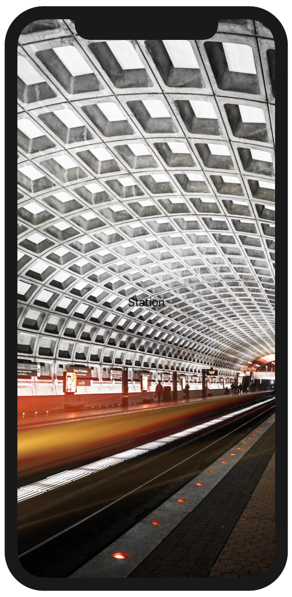
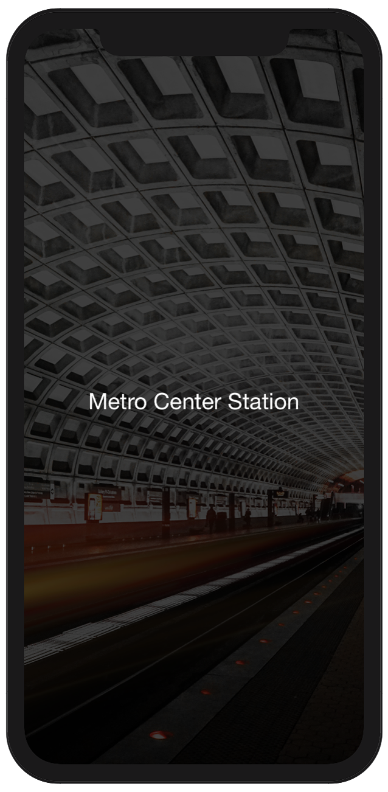
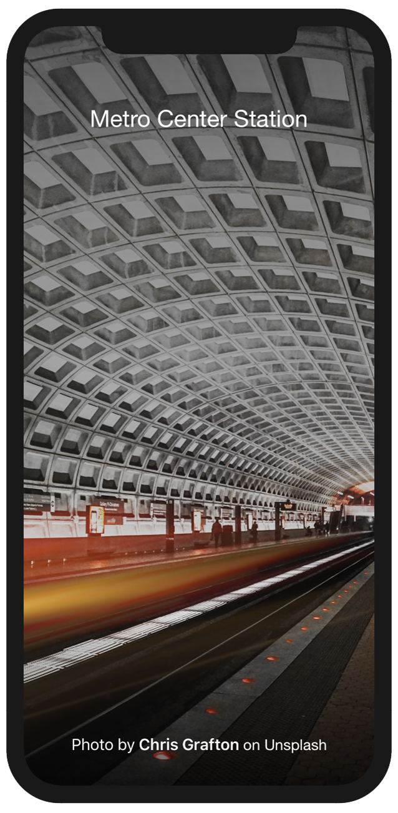

# Tint Overlay

 

  
  
  

Tint overlay is a project that shows using SwiftUI how to add a background image and apply a gradient tint.

This is a beginner level project using text modifiers with regular and semibold font weights, and changing the font colour.  Using an image from Unsplash.  Adding a black tint, then transform it to a gradient using a colour array.

### Installation

1. Clone or download the project to your local machine
2. Open the project in Xcode
3. Run the simulator

## Acknowledgements

The following resource was used in the development of this project

Background image is by [Chris Grafton](https://unsplash.com/photos/mRxHNzxeYt8)

## Author

* **Andrew Fletcher**

## License

This project is licensed under the MIT License - see the [LICENSE](LICENSE.md) file for details

